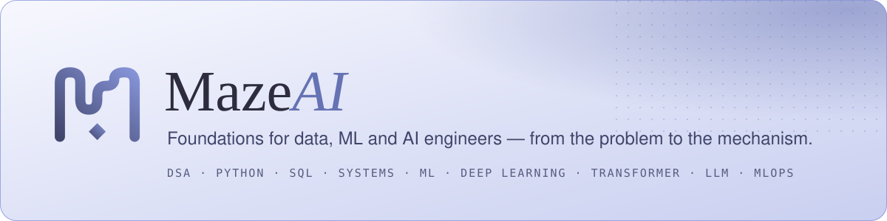

<b><a href="https://maze-ai-lemon.vercel.app/">maze-ai-lemon.vercel.app</a></b>

Core knowledge for data, machine learning and AI engineers. Every lesson starts from **the problem
it was invented to solve**, walks through **the mechanism underneath**, and ends where it breaks —
with runnable code, diagrams, interactive labs and Q&A.

**12 shelves · 185 lessons (118 written, 67 outlined) · 1,100+ searchable sections.**

## Shelves

| # | Shelf | Lessons |
|---|---|---|
| 01 | DSA — data structures & algorithms | 24 |
| 02 | Python | 16 |
| 03 | CS fundamentals | 9 |
| 04 | Distributed systems | 6 |
| 05 | SQL & relational | 12 |
| 06 | NoSQL & data systems | 4 |
| 07 | Machine learning | 35 |
| 08 | Deep learning | 15 |
| 09 | Transformer & architectures | 16 |
| 10 | LLM & GenAI | 30 |
| 11 | ML system design | 5 |
| 12 | MLOps & engineering | 13 |

Shelves 01–07 are complete; 08–12 are partly outlined skeletons (shown faded on the site).

Reading progress is stored in your browser — no account, nothing is sent anywhere.
